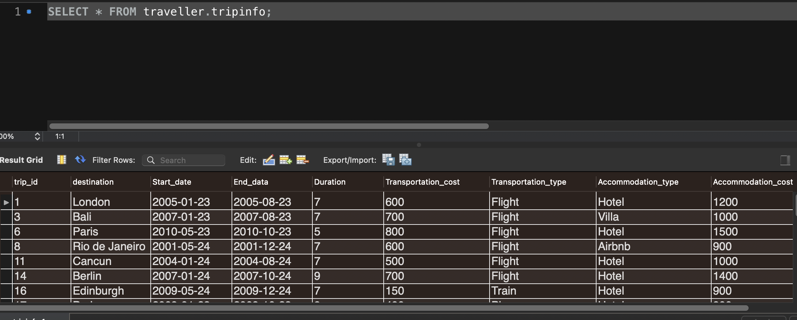

# Travel_Dataset // Data_Engineering project
The travel dataset provides detailed information on various trips taken by travelers, including their destination, travel dates, duration of the trip in days, traveler demographics (name, age, gender, and nationality), as well as the type and cost of accommodation and transportation. This dataset can be used to gain insights into travel patterns, preferences, and behaviors of different types of travelers. It can also be helpful for travel-related businesses, such as travel agencies, to create tailored marketing strategies and travel packages that meet the needs and preferences of different travelers.
### Data source  
- kaggle
- 13 attributes 
1. Trip ID
2. Destination	
3. Start date	
4. End date	
5. Duration (days)	
6. Traveler name	
7. Traveler age	
8. Traveler gender	
9. Traveler nationality	
10. Accommodation type	
11. Accommodation cost	
12. Transportation type	
13. Transportation cost

### column Details
- Trip ID: A unique identifier for each trip taken by a traveler.
- Destination: The name of the city or country visited by the traveler.
- Start date: The date the traveler started the trip.
- End date: The date the traveler ended the trip.
- Duration (days): The number of days the traveler spent on the trip.
- Traveler name: The name of the traveler.
- Traveler age: The age of the traveler at the time of the trip.
- Traveler gender: The gender of the traveler.
- Traveler nationality: The nationality of the traveler.
- Accommodation type: The type of accommodation the traveler stayed in, such as hotel, hostel, or Airbnb.
- Accommodation cost: The cost of the accommodation for the entire trip.
- Transportation type: The mode of transportation used by the traveler, such as plane, train, or car.
- Transportation cost: The cost of transportation for the entire trip.

## BULDING ETL PIPELINE 
  ### Architecture diagram for amazon cloud 
  
  ## Data Model
  - created 5 tables in Smartdraw website connected each table using Uml diagram
  - this is the class representation 
  
  ## Cleaning data using pandas 

  - removed null values
  - split the column and got a city string 
  - removed unwanted symbols from the column 
  - removed duplicate data using substring 
  - lastly converted dataframe to csv file  exported into excel 
  
## Relational data 
- find out the cardinality to understand where to assign foriegn key in the entity 
- understanding the normalisation and add columns in the same table because of the analytics performes so duplicates wont be created 
- found of thr age of traveller can be added in diffrent tablr to find where they travel and  at what age, understanding the table and  what we need in the end while querying in the database and what we want to achvie from the data .

# SQL QUERY IN MYSQL SERVER 
```
create database travel;
use traveller;
show tables;
drop table tripinfo;
drop table traveller;
drop table age;
CREATE TABLE traveller (
  traveller_id INT,
  Traveler_name VARCHAR(15),
  Traveler_gender VARCHAR(20),
  Traveler_nationality VARCHAR(20),
  PRIMARY KEY (traveller_id)
);
CREATE TABLE tripinfo (
  trip_id INT not null,
  traveller_id INT not null,
  destination VARCHAR(15),
  Start_date DATE,
  End_data DATE,
  Duration INT,
  Transportation_cost INT,
  Transportation_type VARCHAR(6),
  Accommodation_type VARCHAR(15),
  Accommodation_cost INT,
  PRIMARY KEY (trip_id),
  FOREIGN KEY (traveller_id) REFERENCES traveller(traveller_id)
);
CREATE TABLE age (
  traveller_id INT NOT NULL,
  Traveler_age INT,
  trip_id INT NOT NULL,
  FOREIGN KEY (trip_id) REFERENCES tripinfo(trip_id),
  FOREIGN KEY (traveller_id) REFERENCES traveller(traveller_id)
);

show tables;
alter table traveller  rename to  traveller_data ;
select * from tripinfo;
alter table tripinfo add constraint primary key(trip_id);
select * from traveller_data;
alter table traveller_data  add constraint primary key(traveller_id);
select * from age ;

```
	





Simple Query performance 
```
select * from tripinfo;
select trip_id, duration,transportation_type from tripinfo
where transportation_type = 'flight' and duration = 7;

select traveler_age from age
group by traveler_age
order by traveler_age desc;

select * from traveller
where Traveler_gender = 'Female' and Traveler_nationality ='indian';
```
step 3 transforming data to s3 bucket - storage 
- created a AWS account 
- in (Iam ) to manage the users , created limited users to access the cloud for secrity 
- created users , name , password
- gave perssion for admit access , where most of the work will be done by the admin
``` {
    "Version": "2012-10-17",
    "Statement": [
        {
            "Effect": "Allow",
            "Action": "*",
            "Resource": "*"
        }
    ]
}
```
- console sign in : https://747063478910.signin.aws.amazon.com/console
- downloaded a csv file [csv_file](https://github.com/Nidhi3338/Travel_dataset/blob/main/Nidhi-jag_credentials%20(1).csv)
- we create security goup in VPN , for safty what customers to be added 
- we do data ETL ( data from sourse to extracxt and machine to transforme and load  into warehouse)
- two difrrent types of implemting data warehouse 
1. cloud 
2. on local 

## cloud_data_flow 
- 
## redshift 
it is a relational databbase warehouse 
- OLTP AND OLAP know the diffrence 
- 
Step 4 (dimensional model )


